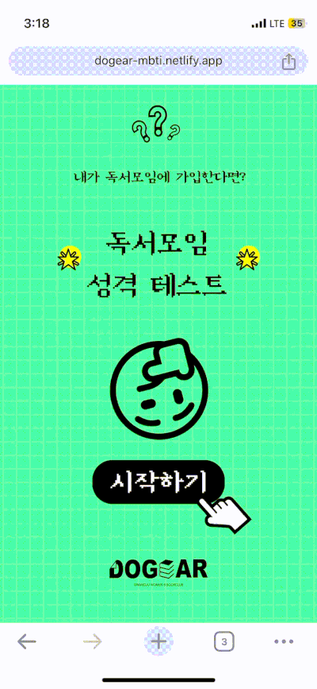
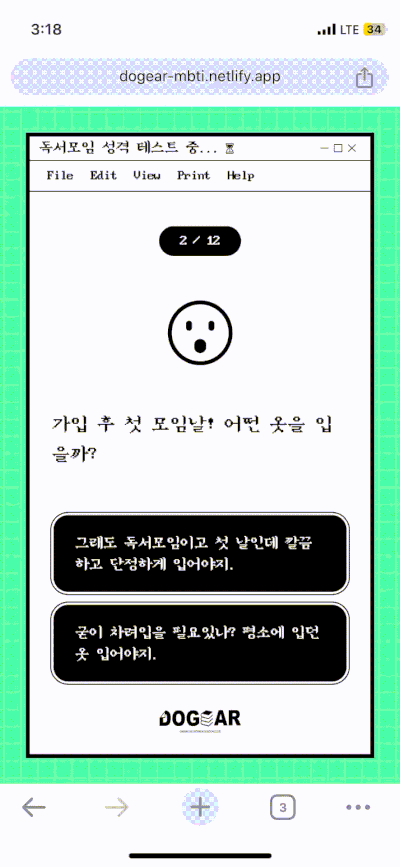
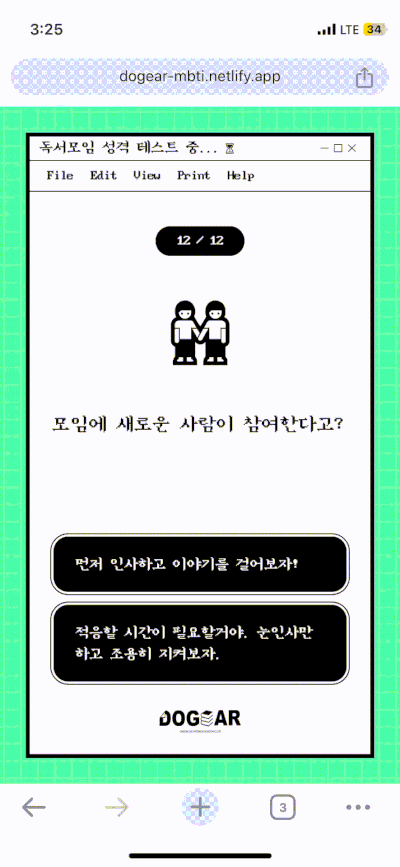
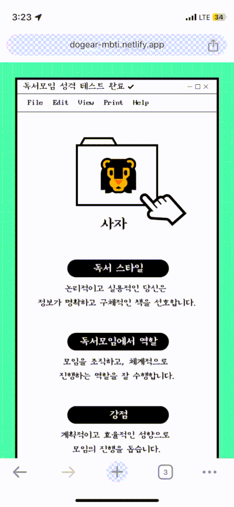
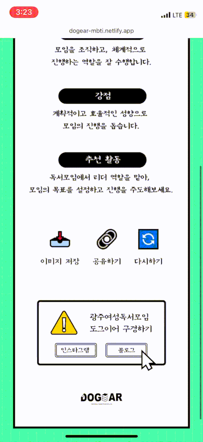

# 📚 내가 독서모임에 가입한다면? 독서모임 성격 테스트

## [🔗테스트 바로가기](https://dogear-mbti.netlify.app)



<br/>
<br/>

## 기술 스택


<br/>
<br/>

## 주요 기술

### step을 0으로 초기화 하고 변동이 있을 때마다 화면을 변경

```tsx
{
  /* 시작 */
}
{
  step === 0 && <Intro nextStep={nextStep} />;
}

{
  /* 테스트 진행 */
}
{
  step > 0 && step < 13 && <Question step={step} nextStep={nextStep} answers={answers} setAnswers={setAnswers}></Question>;
}

{
  /* 테스트 완료 */
}
{
  step === 13 && <Result answers={answers} reStart={reStart} />;
}
```

<br/>
<br/>

### 테스트 문항 노출 및 선택항목 누적산출

```tsx
// 결과 데이터 호출
useEffect(() => {
  fetch('../api/questions.json')
    .then((res) => res.json())
    .then((data: QuestionData[]) => {
      setData(data);
    })
    .catch((error) => console.error('Error loading questions:', error));
}, []);

if (data.length === 0) {
  return <div>로딩중...</div>;
}

const { title, type, A, B } = data[step - 1] || {};

// 유저 문항 선택시 누적산
const handleAnswer = (answer: 'A' | 'B') => {
  const newAnswers = { ...answers };
  // console.log(answer + newAnswers);

  newAnswers[type] = answers[type] + (answer === 'A' ? 1 : 0);

  setAnswers(newAnswers);
  nextStep();
};
```



<br/>
<br/>

### 결과 데이터 산정 및 표시

```tsx
const { EI, SN, TF, JP } = answers;
const mbti = `${EI < 2 ? 'I' : 'E'}${SN < 2 ? 'N' : 'S'}${TF < 2 ? 'F' : 'T'}${JP < 2 ? 'P' : 'J'}`;
const result: ResultItem | undefined = data[mbti];
const { writer, img } = result;
```



<br/>
<br/>

### 결과 이미지 저장

```tsx
// a태그를 생성하여 download 속성에 url을 매핑하여 다운로드 실행
const handleSaveResult = () => {
  const link = document.createElement('a');
  link.href = `/assets/download/result_${img}`;
  link.download = `result_${img}`;
  document.body.appendChild(link);
  link.click();
  document.body.removeChild(link);
};
```



<br/>
<br/>

### 결과 공유

```tsx
// 클립보드에 복사 및 Toast 메시지 출력
const handleShareResult = () => {
  navigator.clipboard
    .writeText(baseUrl)
    .then(() => {
      setShowToast(true);
      setTimeout(() => {
        setShowToast(false);
      }, 3000);
    })
    .catch((err) => console.error('Failed to copy: ', err));
};
```


